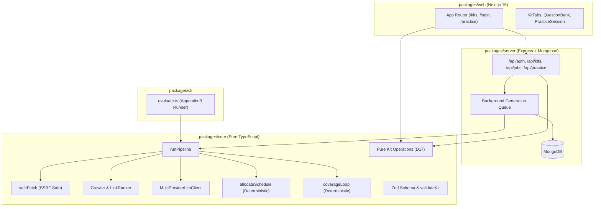

# PrepMe — AI Interview Prep Kit Generator

PrepMe is an automated, grounded interview preparation kit generator and study platform. Given any job description and company website URL, PrepMe crawls company intelligence, extracts and grounds role requirements against verbatim evidence, plans targeted interview questions, verifies 100% must-have coverage, and compiles a deterministic multi-day study schedule with spaced-repetition practice flashcards.

Built for the **Trao Assessment** in strict accordance with the project specification, [`.ai/PLAN.MD`](./.ai/PLAN.MD), and [`DECISIONS.MD`](./DECISIONS.MD).

---

## Table of Contents
1. [Project Overview and Stack](#1-project-overview-and-stack)
2. [Setup & Running](#2-setup--running)
   - [Local Development](#local-development)
   - [CLI Batch Evaluation](#cli-batch-evaluation)
   - [Running Tests](#running-tests)
3. [LLM Provider and Fallback Chain](#3-llm-provider-and-fallback-chain)
4. [Architecture & Dependency Rules](#4-architecture--dependency-rules)
5. [Retrieval Approach & Grounding Sources](#5-retrieval-approach--grounding-sources)
6. [Pipeline Step Sequence](#6-pipeline-step-sequence)
7. [Kit Builder, State Model & Merge-Time Preservation](#7-kit-builder-state-model--merge-time-preservation)
8. [Deterministic Schedule Allocation](#8-deterministic-schedule-allocation)
9. [Coverage Loop & Stopping Rules](#9-coverage-loop--stopping-rules)
10. [Edge Case Handling](#10-edge-case-handling)
11. [Jobs, Persistence & Duplicate Detection](#11-jobs-persistence--duplicate-detection)
12. [Batch Evaluation Rules (Appendix B)](#12-batch-evaluation-rules-appendix-b)
13. [Creative Features](#13-creative-features)
14. [Design Decisions, Trade-offs & Known Limitations](#14-design-decisions-trade-offs--known-limitations)

---

## 1. Project Overview and Stack

- **Monorepo Structure (`npm workspaces`):**
  - `@prepkit/core` (`packages/core`): Pure business logic, pipeline steps, safe retrieval, deterministic coverage, schedule allocation, pure kit operations, and schemas.
  - `@prepkit/server` (`packages/server`): Express 4 REST API, Mongoose 8 models, background job runner, JWT session authentication via `httpOnly` secure cookies.
  - `@prepkit/web` (`packages/web`): Next.js 15 (App Router) frontend styled with Tailwind CSS, matching the dark `interviewing.io` aesthetic (`#0a0a0f` background, `#13131a` cards, `#14b8a6` teal accents, Inter typography).
  - `@prepkit/cli` (`packages/cli`): Standalone evaluation runner (`npm run evaluate`) producing Appendix B JSON.
- **Runtime:** Node.js v20+ / v22 LTS, TypeScript 5.7 (strict mode), MongoDB / Mongoose, Vitest.

---

## 2. Setup & Running

### Prerequisites
- Node.js 20 or higher
- MongoDB instance (local or MongoDB Atlas URI)
- At least one LLM API key (Google Gemini recommended, or Mistral)

### Local Development

1. **Clone and install dependencies:**
   ```bash
   git clone <repo-url>
   cd trao_assignment
   npm install
   ```

2. **Configure environment variables:**
   ```bash
   cp .env.example .env
   ```
   Edit `.env` to provide your credentials:
   ```env
   # Primary Provider: Google Gemini
   LLM_PROVIDER_1_NAME=gemini
   LLM_PROVIDER_1_API_KEY=your_gemini_api_key_here
   LLM_PROVIDER_1_BASE_URL=https://generativelanguage.googleapis.com/v1beta/openai
   LLM_PROVIDER_1_MODEL=gemini-3.6-flash
   LLM_PROVIDER_1_RPM=15
   LLM_PROVIDER_1_TPM=1000000
   LLM_PROVIDER_1_CONCURRENCY=2

   # Fallback Provider: Mistral
   LLM_PROVIDER_2_NAME=mistral
   LLM_PROVIDER_2_API_KEY=your_mistral_api_key_here
   LLM_PROVIDER_2_BASE_URL=https://api.mistral.ai/v1
   LLM_PROVIDER_2_MODEL=mistral-small-latest

   # Database & Auth
   MONGODB_URI=mongodb://localhost:27017/prepkit
   SESSION_SECRET=your_long_random_jwt_secret_here
   PORT=4000
   CLIENT_ORIGIN=http://localhost:3000
   NEXT_PUBLIC_API_URL=http://localhost:4000
   ```

3. **Build all packages:**
   ```bash
   npm run build
   ```

4. **Start Backend & Frontend:**
   - **Backend Server** (runs on `http://localhost:4000`):
     ```bash
     npm run dev:server
     ```
   - **Frontend App** (runs on `http://localhost:3000`):
     ```bash
     npm run dev:web
     ```
   - *Or run both concurrently:*
     ```bash
     npm run dev
     ```

### CLI Batch Evaluation

Run the automated batch evaluation matching Appendix B directly from the repository root:
```bash
npm run evaluate -- --input test/fixtures/cases.json --output test/output/kits.json
```
To run in offline demo mode using the instant deterministic mock generator:
```bash
npm run evaluate -- --input test/fixtures/cases.json --output test/output/kits.json --fake-llm
```

### Running Tests
Run all 145 unit and integration tests across all workspaces:
```bash
npm test
```

---

## 3. LLM Provider and Fallback Chain

The LLM client ([`packages/core/src/llm/llmClient.ts`](packages/core/src/llm/llmClient.ts)) implements an enterprise-grade multi-provider fallback chain designed to withstand provider outages and rate limits:

1. **Primary Provider:** `Google Gemini` (`gemini-3.6-flash`) using Google's OpenAI-compatible endpoint.
2. **Secondary Fallback:** `Mistral` (`mistral-small-latest`).
3. **Tertiary Fallback:** `GLM` / Offline Deterministic Mock.

### Fault Tolerance & Circuit Breaking
- **Daily Quota Discrimination:** Inspects HTTP 429 status and response text. If `RESOURCE_EXHAUSTED` or daily quota limits are exceeded, the provider is marked exhausted immediately to prevent wasting time on hopeless retries, and requests route straight to the next provider.
- **Transient Rate Limits:** Standard per-minute 429 responses back off using exponential jitter or the server's `Retry-After` header.
- **Circuit Breaker:** Trips after 3 consecutive 5xx failures with a 60-second cooldown period.
- **Development Cache:** Hashes system + user prompts to disk (`.cache/llm/`) to eliminate duplicate API consumption during development and regression testing.

---

## 4. Architecture & Dependency Rules

### Strict Purity Rule (5.2)
`packages/core` is completely decoupled and self-contained:
- **Rule:** `packages/core` MUST NEVER import Express, Mongoose, MongoDB, or Next.js.
- `@prepkit/server`, `@prepkit/web`, and `@prepkit/cli` depend on `@prepkit/core`.



---

## 5. Retrieval Approach & Grounding Sources

1. **SSRF-Protected Fetcher ([`safeFetch.ts`](packages/core/src/retrieval/safeFetch.ts)):**
   - Blocks private/loopback IP ranges (`127.0.0.0/8`, `10.0.0.0/8`, `172.16.0.0/12`, `192.168.0.0/16`, `169.254.0.0/16`, `::1`).
   - Resolves DNS first and validates IP addresses before opening sockets.
   - Enforces 2MB maximum content length and strictly allows HTML/text content-types.
   - Restricts redirects (max 3) and re-verifies destination IPs on each redirect hop.
2. **Crawler & Link Ranker ([`crawler.ts`](packages/core/src/retrieval/crawler.ts)):**
   - Parses `robots.txt` and obeys `Disallow:` rules.
   - Discovers pages via HTML links and sitemaps (`/sitemap.xml`).
   - Ranks candidates using keyword scoring (`/about`, `/careers`, `/jobs`, `/values`, `/team`, `/culture`).
3. **Public Discussion Search ([`search.ts`](packages/core/src/retrieval/search.ts)):**
   - Queries the public Algolia Hacker News search API for interview and culture discussions.
   - Filters out non-relevant stories and extracts interview hints.
4. **Rejected Sources & Justification:**
   - *Reddit:* Requires registered OAuth applications and actively blocks automated IP ranges.
   - *Glassdoor / LinkedIn:* Heavy anti-bot CAPTCHAs and paywalls violating automated retrieval guidelines.

---

## 6. Pipeline Step Sequence

| Step | Function | Type | Input | Output |
|---|---|---|---|---|
| **1. Crawl & Research** | `crawlSite`, `searchDiscussions` | Code + HTTP | Company URL | Cleaned page texts & sources |
| **2. Extract Requirements** | `extractRequirements` | LLM + Schema | Job description | Requirements with `evidence` quotes & priorities |
| **3. Grounding Verification** | `extractRequirements` | Code | Extracted requirements | Demotes any requirement lacking verbatim quotes |
| **4. Company Brief** | `generateCompanyBrief` | LLM + Fallback | Pages + Search | Honest summary, what they do, sources |
| **5. Hiring Process** | `extractHiringProcess` | LLM + Search | Discussion text | Detected interview stages |
| **6. Question Planning** | `planQuestions` | Code | Process + Requirements | Target question count per category |
| **7. Question Generation** | `generateQuestions` | LLM per category | Category + Requirements | Category-specific questions & outlines |
| **8. Flashcard Generation** | `generateFlashcards` | LLM | Questions & Requirements | Active recall Q&A flashcards |
| **9. Coverage Verification** | `checkCoverage` | Plain Code | Requirements & Questions | Identified coverage gaps |
| **10. Coverage Repair Loop**| `runCoverageLoop` | LLM + Code | Uncovered Musts | Targeted questions for gaps (up to 2 passes) |
| **11. Schedule Allocation** | `allocateSchedule` | Plain Code | Questions & Days | Deterministic daily study schedule |
| **12. Kit Validation** | `validateKit` | Zod + Cross-ref | Final kit object | Validated Appendix A Kit |

---

## 7. Kit Builder, State Model & Merge-Time Preservation

### Inline Builder Operations
Users can customize their kits in real time:
- **Questions:** Edit prompt, edit outline, change difficulty (1–3), pin/unpin, delete, add custom question, move between categories, and reorder within a category.
- **Flashcards:** Edit front/back, add, delete, pin.
- **Brief:** Inline editable summary and product descriptions.

### Merge-Time Preservation Rule (7.6 & D17)
When a user triggers **Regenerate Category** or **Regenerate Schedule**:
1. **Dynamic Replaceable Set:** Computed strictly at merge time. Only system-generated, unpinned items in the targeted section are replaced.
2. **Untouched Items:** User-authored items (`origin: "user"`), pinned items (`pinned: true`), and all items in other categories are 100% preserved.
3. **Snapshot Undo (D17):** Before any regeneration executes, a deep snapshot of the kit is pushed onto `kit.history`. If the user dislikes the new generation, clicking **Undo Regeneration** instantly reverts the kit to its previous state.

---

## 8. Deterministic Schedule Allocation

The schedule allocator ([`packages/core/src/schedule/allocate.ts`](packages/core/src/schedule/allocate.ts)) is a **100% model-free, deterministic TypeScript function**:
- Allocates study material across exactly $N$ days ($1 \le N \le 90$).
- **Priority & Difficulty Ordering:** Must-have requirements and higher-difficulty questions (Difficulty 3) are scheduled earlier in the timeline.
- **Integer Minutes:** Every study session duration is an exact integer minutes value (e.g., 45, 60, 90 mins).
- **100% Must-Have Inclusion:** Ensures every must-have requirement appears in at least one scheduled day.

---

## 9. Coverage Loop & Stopping Rules

Coverage checking ([`checkCoverage.ts`](packages/core/src/coverage/checkCoverage.ts)) is computed by code, not the LLM:
1. Compares all `requirement_ids` referenced by questions against `role.requirements`.
2. If any `priority: "must"` requirement is unreferenced, `coverage.passes` is `false`.
3. The coverage loop ([`coverageLoop.ts`](packages/core/src/coverage/coverageLoop.ts)) triggers a targeted second-pass generation specifically prompt-engineered for the missing requirements.
4. **Deterministic Hard Fallback:** If an LLM fails to cover a must-have after two passes, the code synthesizes a grounded question directly from the requirement text and evidence quote. **No kit ever ships with an uncovered must-have.**

---

## 10. Edge Case Handling

| Edge Case | Behavior & Prevention |
|---|---|
| **Dead URL / 404 / Timeout** | `safeFetch` catches error gracefully; brief marks source as unavailable with honest note; pipeline continues. |
| **Site with No About/Careers Page** | Crawler scans home page; brief honestly states no hiring information was published; no requirements or facts invented. |
| **Two-Line Job Description** | Extracts only genuine stated skills; emits a `thin_job_description` warning; never invents imaginary prerequisites. |
| **Discussion Search Returns Nothing** | Defaults gracefully to standard 4-stage engineering interview process without error. |
| **Prompt Injection in JD or HTML** | Wrapped in untrusted boundary tags (`wrapUntrusted.ts`) instructing model to treat input as data, never instructions. |
| **Model Returns Malformed JSON** | Strip code fences $\to$ JSON repair $\to$ Zod schema validation $\to$ retry on parse failure. |
| **Provider Daily Quota Exceeded** | Detected via 429 status & `RESOURCE_EXHAUSTED` keyword; immediately switches to next provider in fallback chain. |
| **1-Day and 60-Day Schedules** | Scaled proportionally: 1-day compresses essential must-haves; 60-day spaces out deep dives with dedicated review days. |

---

## 11. Jobs, Persistence & Duplicate Detection

- **Background Job Runner ([`jobRunner.ts`](packages/server/src/jobs/jobRunner.ts)):**
  - POST `/api/kits` immediately responds with HTTP 202 (`{ kitId, jobId, status: "generating" }`).
  - Generation runs asynchronously in the background. The client polls `GET /api/kits/:id` or `GET /api/jobs/:id`.
  - Supports retries if a transient network failure occurs.
- **Duplicate Prevention (D7):**
  - Computes a SHA-256 hash of the normalized job description and company URL (`computeKitHash`).
  - If a kit with the same hash exists, returns the existing kit unless `force: true` is passed.
- **Session Expiry Resilience (7.2):**
  - If a user's session expires while editing, an in-place `ReauthModal` prompts for login without navigating away or discarding unsaved edits.

---

## 12. Batch Evaluation Rules (Appendix B)

The CLI evaluation tool executes cases sequentially and writes an output matching the Appendix B specification:

```bash
npm run evaluate -- --input test/fixtures/cases.json --output test/output/kits.json
```

**Outcome Rules:**
- `ok`: Case completed successfully and passed `validateKit`.
- `partial`: Output contains valid sections but logged recoverable warnings.
- `failed`: Extraction or validation was impossible (error captured in output entry).
- **Fault Isolation:** A failure in case $i$ never halts the runner. Case $i+1$ proceeds immediately.

---

## 13. Creative Features

### 1. Interactive 60-Second Timed Practice Mode
- **Spaced Repetition Flashcards:** Flashcard queue ordered per Decision 9:
  1. Unseen flashcards first.
  2. Lowest confidence score first (1 before 5).
  3. Oldest review date first.
- **Active Recall Under Pressure:** 60-second countdown timer with visual urgency alerts.
- **Written Answer Simulation:** Integrated textarea to practice verbalizing responses before revealing reference outlines.
- **Keyboard Shortcuts:** Press `Space` to reveal outline; press `1`–`5` to record confidence and advance.
- **Coverage Readiness Metrics:** Live metrics displaying overall readiness, average confidence, and remaining unpracticed must-have skills.

### 2. D17 Merge-Time Undo Snapshots
- Any section regeneration (`brief`, `schedule`, or specific `category`) automatically records a pre-regeneration snapshot.
- One-click **Undo Regeneration** instantly rolls back unwanted AI generations while preserving manually written questions.

---

## 14. Design Decisions, Trade-offs & Known Limitations

- **Trade-off 1: Pure Functions vs Model Generation for Schedule:**
  - *Decision:* Schedule allocation is 100% deterministic code.
  - *Rationale:* Ensures exact day counts, guaranteed coverage of all must-haves, zero hallucinations of durations, and reliable performance across varying model providers.
- **Trade-off 2: In-Memory / Polling vs WebSockets:**
  - *Decision:* Standard HTTP polling every 2 seconds during kit generation.
  - *Rationale:* Eliminates WebSocket reconnection complexity across serverless/container hosts, simplifies reverse proxy configuration, and provides reliable state synchronization.
- **Known Limitations:**
  - Sites heavily protected by Cloudflare Turnstile or full client-side JavaScript SPAs without static HTML require headless browser prerendering (e.g. Playwright), which was intentionally excluded to keep the deployment lightweight and SSRF-safe.

---

## License
MIT. Created for the Trao Assessment.
